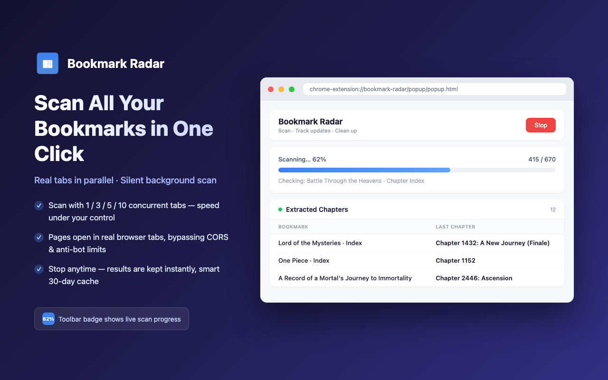
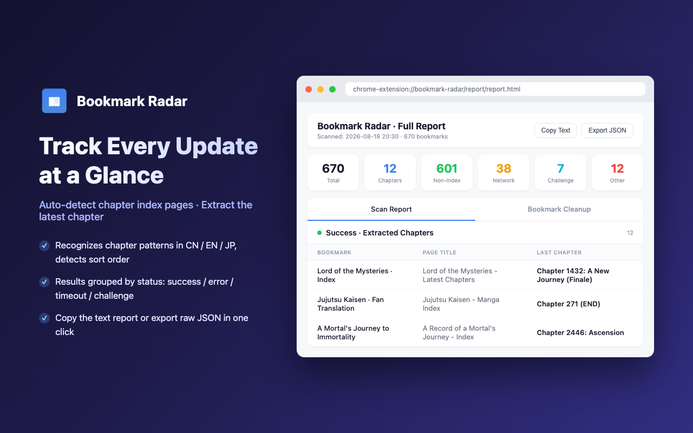
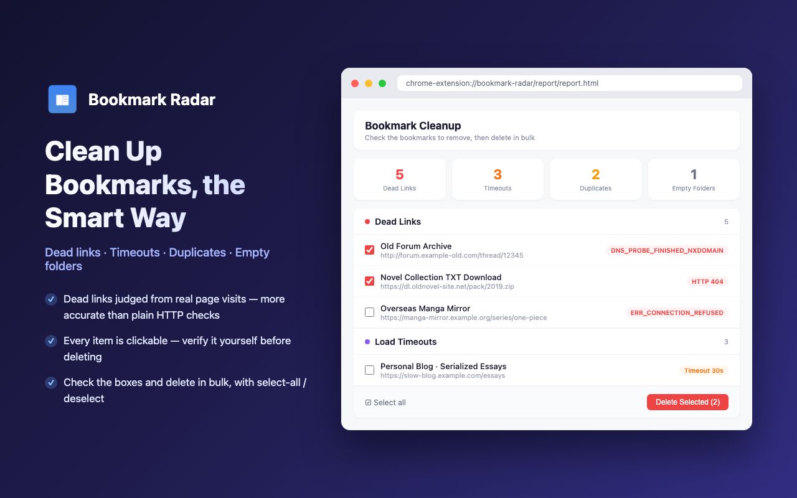

# Bookmark Radar

> Scan your browser bookmarks, extract the latest chapters of novels/manga, detect dead links and duplicates, and generate a categorized briefing report.

[中文版](README.md) | [English](README.en.md)


## Screenshots

| Scan | Report | Cleanup |
|:---:|:---:|:---:|
|  |  |  |

## Features

- **Full scan + concurrency** — Reads all bookmarks and checks them with 1/3/5/10 concurrent tabs (default 1, last choice remembered); the toolbar badge shows live progress percentage
- **Smart cache** — 30-day per-bookmark cache for instant re-scans; directory pages (extracted chapters), timeouts and challenge pages are never cached so they are re-checked every scan to track updates; "Force" clears the cache and re-scans; rescan results are written back to the cache so stale conclusions never resurface
- **Chapter update detection** — Compares against the previous chapter snapshot; bookmarks with new chapters are highlighted, and the report page can filter "updates only"
- **Silent background** — Worker tabs live in a collapsed tab group and never interrupt your browsing
- **Directory detection** — Automatically recognizes novel/manga directory pages (Chinese / English / Japanese chapter patterns) and extracts the last chapter with smart ordering detection
- **Grouped report** — Results grouped by status: success / network error / access denied / server error / timeout / human verification; viewable full-width in a dedicated report tab
- **Bookmark cleanup** — Detects dead links, load timeouts, duplicate bookmarks and empty folders; entries are clickable for manual confirmation, with batch deletion
- **Selective rescan** — Check entries on the report page (Shift range-select supported) to bypass the cache and rescan; results merge into the report in place
- **Reliable interruption** — Stop a scan at any time and instantly see partial results; auto-aborts (keeping progress) if a worker tab is closed accidentally
- **Configurable timeout** — Page load timeout is user-configurable (default 30s, 5–300s)
- **Cloudflare handling** — Auto-detects challenge pages; "Human verify" is checked by default and temporarily brings the tab to the foreground so the JS challenge can run (background tabs have `requestAnimationFrame` suspended and can never pass); or pass it manually via the report link — the clearance cookie then applies to the whole domain
- **Export** — Copy as text / export JSON
- **Bilingual UI** — Automatically switches between Chinese and English based on the browser language

## Installation

1. Clone this repository:
   ```bash
   git clone https://github.com/firzen/bookmark-radar.git
   ```
2. Open `chrome://extensions/` and enable **Developer mode** (top right)
3. Click **Load unpacked** and select the project directory

## Usage

1. Click the toolbar icon and configure concurrency / timeout seconds (check **Force** to clear the cache and re-scan; **Human verify** is checked by default — uncheck it to skip auto-passing challenges)
2. Click **Start Scan**; you can **Stop** at any time to view partial results; the toolbar badge shows live progress
3. The popup shows a quick list of **extracted chapters**; click **Open Full Report ↗** for the full-width report and bookmark cleanup
4. In the report page, **check entries to rescan**, filter "updates only", or **Copy Text** / **Export JSON** to save the results

## Report Groups

| Group | Meaning |
|-------|---------|
| Success – chapters extracted | Directory page; last chapter extracted |
| Success – not a directory | Page loaded fine but is not a directory page |
| Network error | DNS failure, connection refused/reset, etc. |
| Access denied / not found | 403 / 404 |
| Server error | 5xx server-side failures |
| Timeout | Page load exceeded the configured seconds (default 30; not cached, re-checked next scan) |
| Human verification | Cloudflare challenge page (not cached; can be passed manually) |
| Unparseable | Blocked by CSP or unrecognized structure |

## Comparison with Bookmarks Clean Up

[Bookmarks Clean Up](https://chromewebstore.google.com/detail/bookmarks-clean-up/oncbjlgldmiagjophlhobkogeladjijl) is a pure cleanup tool; Bookmark Radar **combines content tracking and cleanup**.

| | Bookmarks Clean Up | Bookmark Radar |
|---|---|---|
| **Core** | Remove duplicates / dead links / empty folders | Latest-chapter tracking + cleanup in one |
| **Dead link detection** | HTTP status code only | Full page load + content analysis (catches "200 but dead" pages) |
| **Concurrency / cache** | None | Multi-tab concurrency + 30-day cache |
| **Output** | Cleanup list | Chapter briefing + cleanup suggestions (one-click delete) |
| **Typical user** | People with messy bookmarks | Novel/manga followers who also want healthy bookmarks |

## Why not fetch / ajax?

`fetch()`-ing bookmark URLs from the Service Worker looks simpler but fails in practice: most sites have no CORS headers and block the request outright; SPA sites return an empty HTML shell with no JS-rendered chapter list; encodings like GBK need manual decoding.

This extension uses **background tabs + URL navigation** instead:

| | fetch() | Background tabs (this extension) |
|---|---|---|
| CORS blocking | ✗ blocked | ✓ native browser load, no restrictions |
| JS-rendered content | ✗ raw HTML only | ✓ fully rendered DOM |
| Encoding | manual TextDecoder | handled by the browser |
| Anti-bot / challenges | easily blocked | identical to a real user, cookies shared |
| Resource cost | low | low (tab reuse + collapsed tab group) |

> The price is managing tab lifecycles — but for an extension facing arbitrary third-party websites, reliability matters far more than code simplicity.

## Architecture

```
bookmark-radar/
├── manifest.json              # MV3 extension config
├── _locales/                  # Bilingual copy (chrome.i18n)
├── background/
│   ├── service-worker.js      # Entry: message routing and global config
│   ├── checker.js             # Per-bookmark pipeline (static fetch → navigate → inject → challenge retry → fallback)
│   ├── scan-runner.js         # Concurrency scheduling & progress (shared by full scan and rescan)
│   └── report-store.js        # Report assembly, cache write-back and chapter snapshots
├── content/
│   └── extractor.js           # Injected script (chapter extraction + directory recognition)
├── shared/
│   ├── classifier.js          # Single source of truth for classification (challenge/error markers, cache rules)
│   ├── renderer.js            # Shared report rendering (popup & report page)
│   └── i18n.js                # i18n helpers
├── popup/                     # Popup UI (scan controls + chapter quick list)
├── report/                    # Full report page (selective rescan + cleanup + export)
└── icons/
```

### Core flow

```
Start scan (optionally clear cache with Force)
    ↓
Load 30-day cache; skipped bookmarks count into progress immediately
    ↓
Create N background tabs + collapsed tab group; uncached bookmarks round-robin assigned
    ↓
Each worker: navigate → wait for load → inject extractor → write result to cache
    ↓
Compare chapter snapshots → mark entries with new chapters as chapterChanged
    ↓
Complete / stop / error → close tabs, clear badge → render report (popup + report page)
```

### Directory recognition algorithm

Multi-signal scoring:

| Signal | Condition | Weight |
|--------|-----------|--------|
| Chapter link ratio | >50% / >30% / >15% | +3 / +2 / +1 |
| Chapter link count | >50 / >20 / >10 | +3 / +2 / +1 |
| List container | ul/ol or class contains chapter/list | +1 |

Score ≥ 3 and ≥ 5 chapter links → directory page. Supported patterns: `第X章/话/回/集` (incl. Chinese numerals), `Chapter X`, `Vol.X`, `Ep.X`, `第X話`, plain numbers `001`, etc.

## Permissions

| Permission | Purpose |
|------------|---------|
| `bookmarks` | Read browser bookmarks |
| `storage` | Cache scan results |
| `tabGroups` | Create the collapsed tab group |
| `scripting` | Inject the extraction script into pages |
| `webNavigation` | Watch tab navigation to capture network-layer errors (DNS / connection / SSL) |
| `<all_urls>` | Allow visiting any bookmarked URL |

> This extension never uploads any data; all processing happens locally.

## Development

No build tools required — plain vanilla JavaScript. Edit the source and hit refresh in `chrome://extensions/`.

Debug entry points:
- Service Worker: `chrome://extensions/` → click the "Service Worker" link
- Popup: right-click the popup → "Inspect"

## Repository

- GitHub: <https://github.com/firzen/bookmark-radar>

## License

MIT
