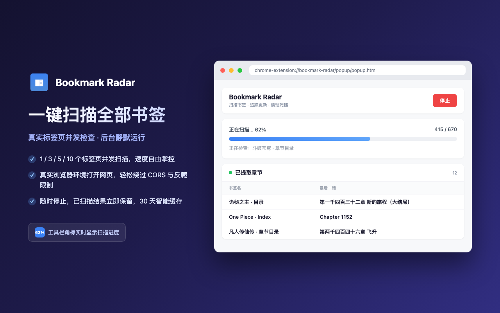
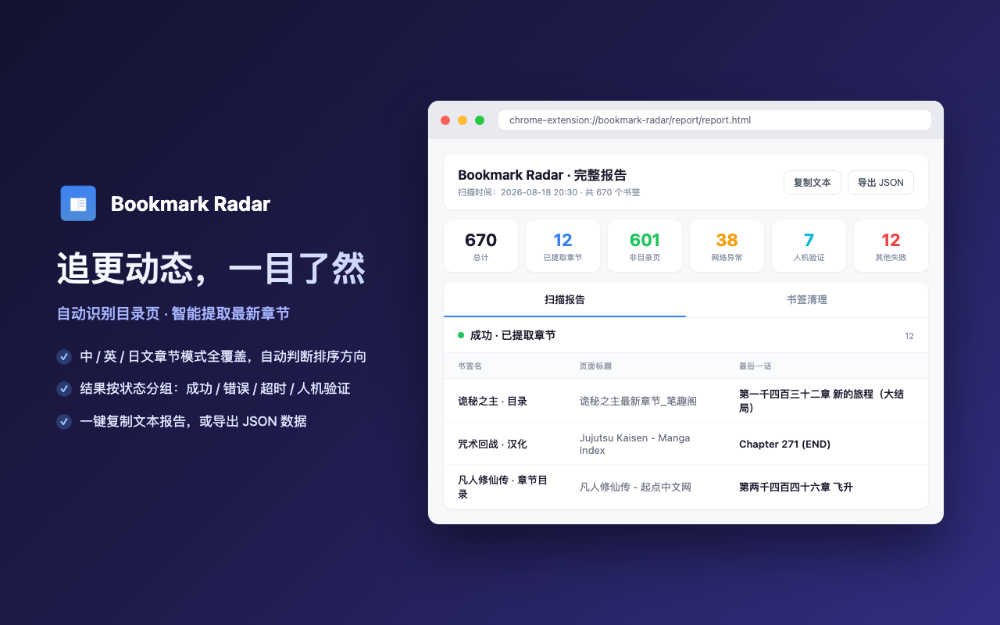
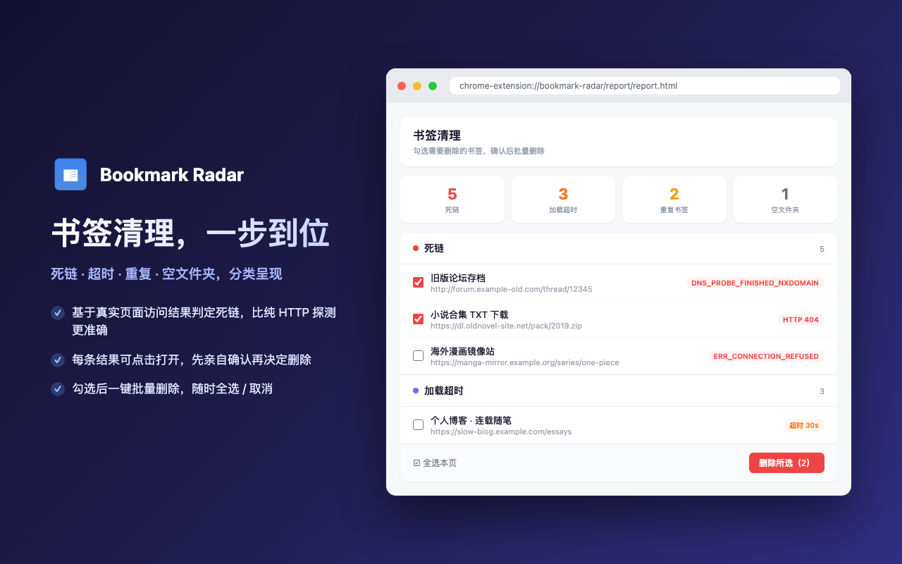

# Bookmark Radar

> 扫描浏览器书签，提取小说/漫画最新章节，检测死链和重复书签，生成分类简报。

[中文版](README.md) | [English](README.en.md)


## 界面预览

| 扫描 | 报告 | 清理 |
|:---:|:---:|:---:|
|  |  |  |

## 功能特性

- **全量扫描 + 并发** — 读取所有书签，1/3/5/10 个标签页并发检查（默认 1，记忆上次选择），工具栏角标实时显示进度百分比
- **智能缓存** — 每个书签独立 30 天缓存，二次扫描秒级完成；目录页（已提取章节）/超时/验证页不缓存，每次重查以追踪更新；勾选「强制」清除缓存重扫；重扫结果同步写回缓存，不会被旧结论覆盖
- **章节更新检测** — 与上次扫描的章节快照对比，有更新的书签高亮标记，报告页可一键筛选「仅显示更新」
- **静默后台** — 工作标签归入折叠标签组，不影响正常浏览
- **目录识别** — 自动判断小说/漫画目录页（中/英/日文章节模式），智能判断排序方向提取最后一话
- **状态分组报告** — 成功 / 网络错误 / 访问受限 / 服务器错误 / 超时 / 人机验证等分组展示，支持新标签页全宽查看
- **书签清理** — 检测死链、加载超时、重复书签、空文件夹；条目可点击打开人工确认，支持勾选批量删除
- **勾选重扫** — 报告页勾选条目（支持 Shift 区间勾选）忽略缓存重新扫描，结果实时合并进报告
- **可靠中断** — 扫描可随时停止并立即展示已有结果；标签被意外关闭时自动中断并保留进度
- **可配置超时** — 页面加载超时可配置（默认 30 秒，范围 5–300 秒）
- **Cloudflare 应对** — 自动识别验证页；「真人验证」默认勾选，临时前台激活标签等 JS 质询通过（后台标签 rAF 被暂停无法自动过），也可点链接手动过验证，cookie 全域名生效
- **数据导出** — 复制文本 / 导出 JSON
- **中英双语** — 界面跟随浏览器语言自动切换中/英文

## 安装

1. 克隆本项目：
   ```bash
   git clone https://github.com/firzen/bookmark-radar.git
   ```
2. 打开 `chrome://extensions/`，开启右上角 **开发者模式**
3. 点击 **加载已解压的扩展程序**，选择项目目录

## 使用方法

1. 点击工具栏插件图标，配置并发数 / 超时秒数（需清缓存重扫时勾选「强制」；「真人验证」默认勾选，需跳过自动过验证时取消）
2. 点击 **「开始扫描」**，扫描中可随时 **「停止」** 查看已有结果，工具栏角标实时显示进度
3. 弹窗展示 **已提取章节** 快捷列表；点 **「打开完整报告 ↗」** 全宽浏览完整报告与书签清理
4. 报告页可勾选条目 **重扫**、筛选「仅显示更新」，或 **「复制文本」** / **「导出 JSON」** 存档

## 报告分组说明

| 分组 | 含义 |
|------|------|
| 成功 - 已提取章节 | 目录页，已成功提取最后一话 |
| 成功 - 非目录页 | 页面正常加载，但不是目录页 |
| 网络错误 | DNS 失败、连接被拒绝/重置等 |
| 访问受限 / 页面不存在 | 403 / 404 |
| 服务器错误 | 5xx 服务端异常 |
| 超时 | 页面加载超过设定秒数（默认 30，可配置；不缓存，下次重查） |
| 需人机验证 | Cloudflare 验证页（不缓存，可手动过验证） |
| 无法解析 | 页面 CSP 限制或结构无法识别 |

## 与 Bookmarks Clean Up 对比

[Bookmarks Clean Up](https://chromewebstore.google.com/detail/bookmarks-clean-up/oncbjlgldmiagjophlhobkogeladjijl) 是纯清理工具；Bookmark Radar **同时具备内容追踪和清理能力**。

| | Bookmarks Clean Up | Bookmark Radar |
|---|---|---|
| **核心功能** | 删除重复/死链/空文件夹 | 最新章节追踪 + 清理一体化 |
| **死链检测** | 仅 HTTP 状态码 | 完整加载页面分析内容（能发现「200 但已失效」） |
| **并发 / 缓存** | 无 | 多标签并发 + 30 天缓存 |
| **输出** | 待清理列表 | 章节简报 + 清理建议（一键删除） |
| **典型用户** | 需要整理书签的人 | 追更小说/漫画 + 保持书签健康的人 |

## 为什么不用 fetch / ajax？

在 Service Worker 里 `fetch()` 书签 URL 看似简洁，实际不可行：绝大多数站点无 CORS 头直接拦截；SPA 站点 `fetch()` 拿不到 JS 渲染后的章节列表；GBK 等编码需手动转换。

本插件采用 **后台标签页 + URL 跳转** 方案：

| | fetch() | 后台标签页（本插件） |
|---|---|---|
| CORS 拦截 | ✗ 被拦截 | ✓ 浏览器原生加载，无限制 |
| JS 渲染内容 | ✗ 只有原始 HTML | ✓ 完整渲染后的 DOM |
| 编码处理 | 需手动 TextDecoder | 浏览器自动适配 |
| 反爬 / 验证 | 易被拦截 | 等同真实用户，可共享 cookie |
| 资源开销 | 低 | 低（标签复用 + 折叠标签组） |

> 代价是要管理标签生命周期，但对需要面对各种不可控第三方网站的插件来说，可靠性远比代码简洁重要。

## 技术架构

```
bookmark-radar/
├── manifest.json              # MV3 插件配置
├── _locales/                  # 中英双语文案（chrome.i18n）
├── background/
│   ├── service-worker.js      # 入口：消息路由与全局配置
│   ├── checker.js             # 单书签检查管道（静态抓取 → 导航 → 注入 → 验证重试 → 兜底）
│   ├── scan-runner.js         # 并发调度与进度（全量扫描与重扫共用）
│   └── report-store.js        # 报告组装、缓存写回与章节快照
├── content/
│   └── extractor.js           # 页面注入脚本（章节提取 + 目录识别）
├── shared/
│   ├── classifier.js          # 分类唯一事实源（验证页/错误页特征、缓存规则）
│   ├── renderer.js            # 报告渲染共享逻辑（popup 与报告页共用）
│   └── i18n.js                # 国际化工具
├── popup/                     # 弹窗界面（扫描控制 + 章节快捷列表）
├── report/                    # 完整报告页（勾选重扫 + 清理 + 导出）
└── icons/
```

### 核心流程

```
触发扫描（可选强制清缓存）
    ↓
加载 30 天缓存，跳过的书签直接计入进度
    ↓
创建 N 个后台标签页 + 折叠标签组，未缓存书签轮询分配
    ↓
各 worker：跳转 URL → 等待加载 → 注入提取 → 结果逐条写缓存
    ↓
对比章节快照 → 有更新的条目标记 chapterChanged
    ↓
完成 / 停止 / 异常 → 关标签、清角标 → 渲染报告（popup + 报告页）
```

### 目录页识别算法

多维度评分：

| 信号 | 条件 | 权重 |
|------|------|------|
| 章节链接占比 | >50% / >30% / >15% | +3 / +2 / +1 |
| 章节链接数量 | >50 / >20 / >10 | +3 / +2 / +1 |
| 列表容器结构 | ul/ol 或 class 含 chapter/list | +1 |

总分 ≥ 3 且章节链接 ≥ 5 → 判定为目录页。章节模式支持：`第X章/话/回/集`（含大写数字）、`Chapter X`、`Vol.X`、`第X話`、纯序号 `001` 等。

## 权限说明

| 权限 | 用途 |
|------|------|
| `bookmarks` | 读取浏览器书签 |
| `storage` | 缓存扫描结果 |
| `tabGroups` | 创建折叠标签组 |
| `scripting` | 向页面注入提取脚本 |
| `webNavigation` | 监听标签页导航，捕获 DNS/连接/SSL 等网络层错误码 |
| `<all_urls>` | 允许访问任意书签 URL |

> 本插件不会上传任何数据，所有处理均在本地完成。

## 开发

无需构建工具，纯原生 JavaScript。修改后在 `chrome://extensions/` 点击刷新即可。

调试入口：
- Service Worker：`chrome://extensions/` → 点击「Service Worker」链接
- Popup：右键插件弹窗 → 「检查」

## 开源地址

- GitHub：<https://github.com/firzen/bookmark-radar>

## License

MIT
